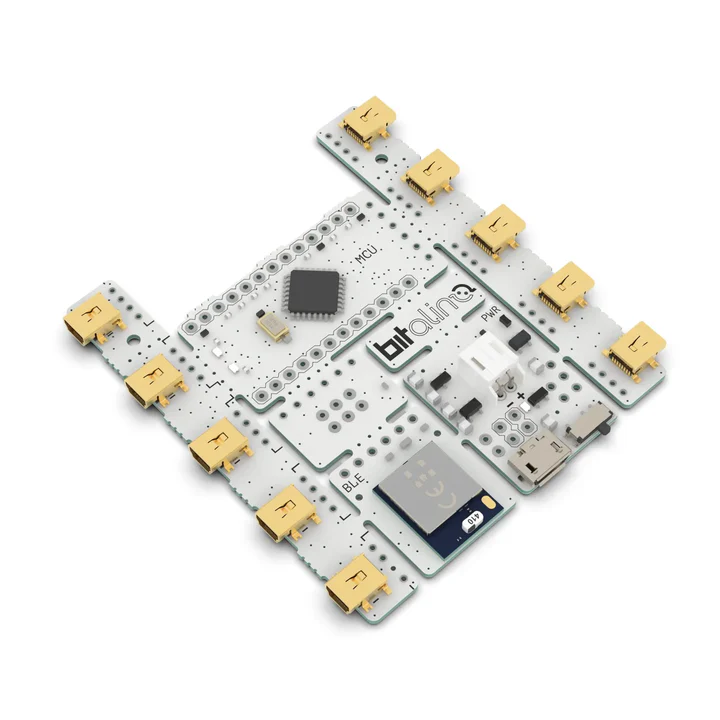

## [Sistemas de adquisición y sincronización de datos biométricos en tiempo real para experimentos cognitivos](https://github.com/jcdalbello/conicet-craving-eeg)

Desarrollé la arquitectura de software en Python usada en experimentos cognitivos, con captura de datos biométricos en tiempo real. Sincronización basada en polling y Lab Screaming Layer con placa de sensores BITalino (r)evolution, para precisión de milisegundos entre estímulos visuales y captura de señales por hardware de electroencefalografía.
Asociado al proyecto de investigación del CONICET "Efecto del consumo de una porción inicial pequeña de papas fritas sobre el deseo de seguir comiendo papas fritas: estudio experimental conductual y de registros de actividad cerebral mediante electroencefalograma".
Formo parte del mismo como ayudante de investigación por parte de la UNTREF.

Repositorio: [https://github.com/jcdalbello/conicet-craving-eeg](https://github.com/jcdalbello/conicet-craving-eeg)

## [Web App de notas](https://github.com/jcdalbello/single-page-note-taking-app)

Web app para crear, clasificar, editar, y borrar notas como en un tablón.
Incluye API backend creada con TypeScript, una base de datos PostgreSQL, y un frontend con React.
Se aplicaron los conceptos de arquitectura por capas, y patrones como MVC, DTOs, y Repositorio, entre otros.

Repositorio: [https://github.com/jcdalbello/single-page-note-taking-app](https://github.com/jcdalbello/single-page-note-taking-app)

## [Trabajo Final de Ingeniería de Software](https://github.com/jcdalbello/ingsoft-tp-final)

Trabajo final de la materia Ingeniería de Software I de la UNTREF, llevada a cabo durante el 2do cuatrimestre del año 2025. El trabajo consiste de una corrección individual del proyecto grupal que se hizo a lo largo de la
segunda mitad de la materia y sirvió como evaluación parcial de la misma.

Esta simple aplicación web implementa una API para el manejo de ofertas y postulaciones de trabajo. Se utiliza Redis como base de datos para persistir la información.

Repositorio: [https://github.com/jcdalbello/ingsoft-tp-final](https://github.com/jcdalbello/ingsoft-tp-final)
