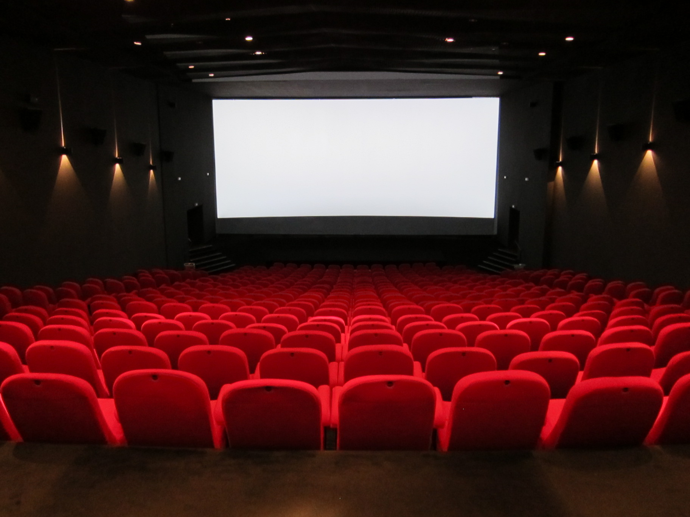

## [Trabajo Final de Ingeniería de Software](https://github.com/jcdalbello/ingsoft-tp-final)

Trabajo final de la materia Ingeniería de Software I de la UNTREF, llevada a cabo durante el 2do cuatrimestre del año 2025. El trabajo consiste de una corrección individual del proyecto grupal que se hizo a lo largo de la
segunda mitad de la materia y sirvió como evaluación parcial de la misma.

Esta simple aplicación web implementa una API para el manejo de ofertas y postulaciones de trabajo. Se utiliza Redis como base de datos para persistir la información.

Repositorio: [https://github.com/jcdalbello/ingsoft-tp-final](https://github.com/jcdalbello/ingsoft-tp-final)

## [API Cine](https://github.com/jcdalbello/api-cine)

API REST desarrollada con TypeScript para la simulacion de gestión de un cine.
Permite crear, buscar, y manejar recursos como películas, salas, y funciones, persistiendolos en una base de datos relacional.

Se aplicaron los conceptos de arquitectura hexagonal, y patrones como MVC, DTOs, y Repositorio, entre otros.

Repositorio: [https://github.com/jcdalbello/api-cine](https://github.com/jcdalbello/api-cine)
